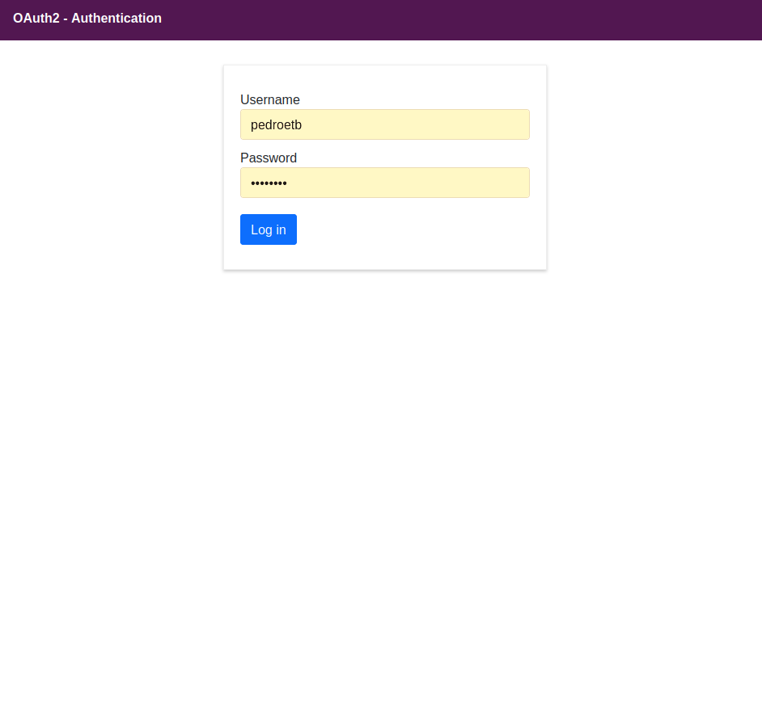
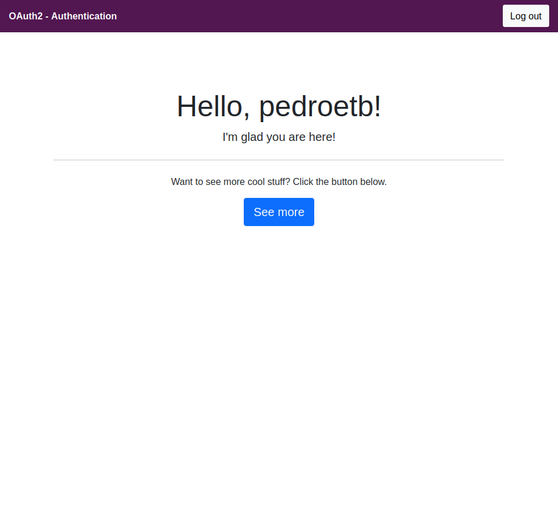

# vue-oauth2
> Made to work with [_node-oauth2-server_](https://www.npmjs.com/package/node-oauth2-server-example) as a server.


## Table of Contents
* [Technologies Used](#technologies-used)
* [Project Setup](#project-setup)
* [Screenshots](#screenshots)
* [Contact](#contact)


## Technologies Used
- Vue 2,
- Vuex for state management,
- Vue Router with Nav Guards for authentication/security reasons,
- axios
- Bootstrap 


## Screenshots




## Project setup
```
npm install
```

### Compiles and hot-reloads for development
```
npm run serve
```

### Compiles and minifies for production
```
npm run build
```

### Lints and fixes files
```
npm run lint
```

### Customize configuration
See [Configuration Reference](https://cli.vuejs.org/config/).


## Contact
Created by [@maciejdzienis](https://www.patoka.io/) - feel free to contact me!